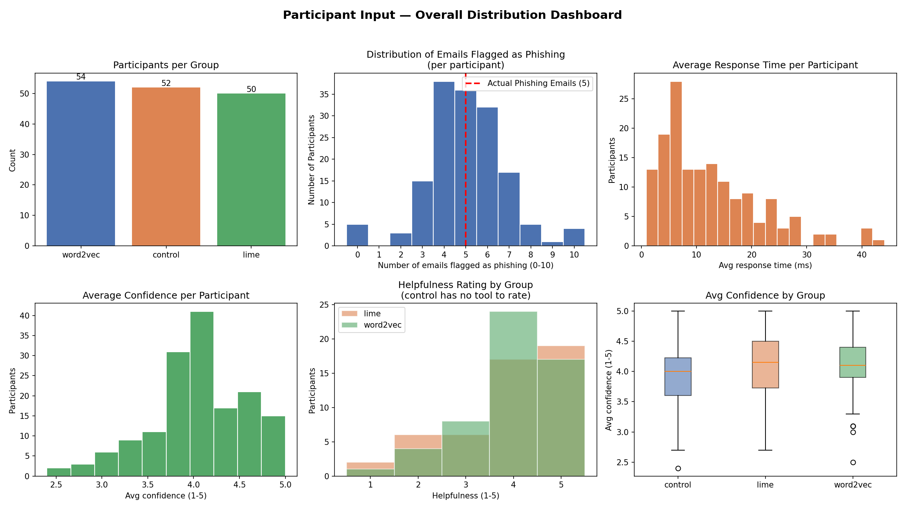

# XAI Phishing Detection Study

> Can explainable AI make ordinary people better at spotting phishing emails? This study compares two XAI techniques, delivered as inline syntax highlighting, against an unassisted control group.

Phishing remains one of the most effective attack vectors precisely because it targets people, not machines. A classifier can flag a suspicious email, but a raw "phishing / not phishing" verdict does little to teach a human _why_ something is off. This project investigates whether **explaining** a model's reasoning, by highlighting the exact words that drove its decision, helps people make faster, more accurate, and better-calibrated judgments.

We train two phishing classifiers, attach a different explainability method to each, and run a controlled human study where participants classify emails with (or without) that assistance.

## Research question

> Which XAI approach best improves an average person's ability to detect phishing emails when explanations are surfaced as inline word-level syntax highlighting?

Participants were split into three conditions:

| Group      | Model              | XAI method                | Assistance shown                     |
| ---------- | ------------------ | ------------------------- | ------------------------------------ |
| `control`  | —                  | none                      | Plain email text                     |
| `lime`     | TF-IDF + LinearSVC | LIME                      | Words highlighted by LIME weights    |
| `word2vec` | BiLSTM + Word2Vec  | Integrated Gradients (IG) | Words highlighted by IG attributions |

Both assisted groups saw the same emails as the control group, but with suspicious tokens highlighted according to their model's explanation.

## Key findings

Based on **161 participants** (control: 52, LIME: 53, IG/Word2Vec: 56).



- **Accuracy & detection.** Both LIME and IG raised accuracy from **63%** (control) to roughly **79%**, and more than doubled sensitivity (d′: `0.64 → ~1.45`), meaning assisted users were far better at separating signal from noise.
- **Speed.** Only IG meaningfully sped up decisions, cutting latency from **14.10s** to **9.66s**. LIME showed no significant speed benefit over control.
- **Calibration.** Brier scores dropped from **0.27** to **~0.16–0.18** under assistance, indicating users' confidence matched their correctness more closely.
- **Method comparison.** LIME and IG were statistically indistinguishable on accuracy, sensitivity, and calibration. **IG's advantage is specific to speed.**

> [!NOTE]
> Statistical significance was confirmed with a one-way ANOVA followed by post-hoc pairwise t-tests. Accuracy, sensitivity, and Brier score differences were significant at `p < .001`; the latency effect was driven specifically by the IG condition.

## Project structure

| Path                         | Description                                                                                                                                    |
| ---------------------------- | ---------------------------------------------------------------------------------------------------------------------------------------------- |
| `RM.ipynb`                   | Main pipeline: EDA, preprocessing, augmentation, model training (LIME & IG), evaluation, and generation of the highlighted email explanations. |
| `analytics.ipynb`            | Analysis of the human study: per-participant metrics, descriptive statistics, ANOVA, post-hoc tests, and visualizations.                       |
| `Phishing_Email.csv`         | Source corpus of phishing and legitimate emails used to train the classifiers.                                                                 |
| `participant_input.csv`      | Collected human study responses (verdicts, response times, confidence, helpfulness) per participant.                                           |
| `distribution_dashboard.png` | Summary dashboard of the study results.                                                                                                        |
| `pyproject.toml`             | Project metadata and pinned dependencies.                                                                                                      |

## Methodology

The study is built in two stages.

**1. Models & explanations (`RM.ipynb`)**

- **Data preparation** — cleaning, exploratory analysis, and text augmentation via synonym replacement to balance the training set.
- **Model A: TF-IDF + LinearSVC**, explained with **LIME**, which perturbs inputs to estimate each word's local contribution.
- **Model B: BiLSTM + Word2Vec**, explained with **Integrated Gradients** (via Captum), which attributes the prediction to input tokens by integrating gradients along a baseline path.
- **Email selection & rendering** — representative emails are chosen and each model's word-level scores are converted into inline syntax highlighting for participants.

**2. Human study analysis (`analytics.ipynb`)**

Per participant, we compute accuracy, sensitivity (d′), decision bias (c), latency, and Brier score, then compare the three groups with ANOVA and post-hoc t-tests.

## Getting started

> [!NOTE]
> This project uses [uv](https://docs.astral.sh/uv/) for dependency management and requires **Python 3.13+**.

Clone the repository and install dependencies:

```bash
uv sync
```

Launch Jupyter and open the notebooks:

```bash
uv run jupyter lab
```

Then run the notebooks in this order:

1. `RM.ipynb` — reproduce the models, explanations, and highlighted emails.
2. `analytics.ipynb` — reproduce the study analysis and figures.

> [!TIP]
> `RM.ipynb` trains a neural model and processes a large corpus (`Phishing_Email.csv`). Running it end-to-end is compute-intensive; a GPU-enabled PyTorch install will speed up the BiLSTM training considerably.

## Tech stack

- **ML & NLP** — scikit-learn (TF-IDF, LinearSVC), PyTorch (BiLSTM), Gensim (Word2Vec), NLTK
- **Explainability** — LIME, Captum (Integrated Gradients)
- **Analysis & visualization** — pandas, NumPy, SciPy, Matplotlib
- **Environment** — Jupyter, uv, Python 3.13

## Takeaway

Providing an explanation, of either kind, substantially improves people's phishing detection and confidence calibration. The _type_ of explanation matters mainly for speed: Integrated Gradients let participants reach equally accurate decisions noticeably faster than LIME or no assistance at all.
